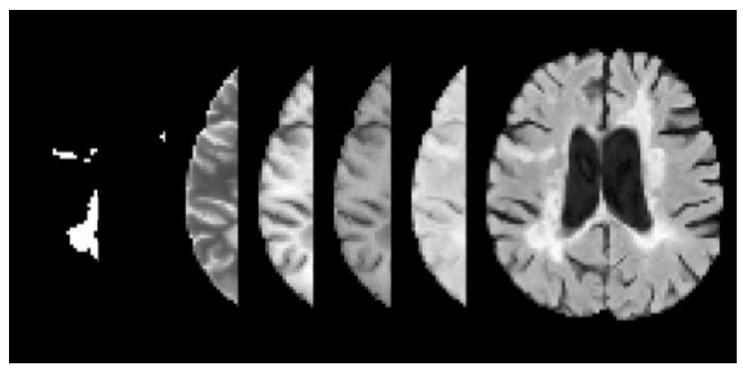

# Artificial Causal Inference
General framework for Artificial Causal Inference on real world scientific experiments

## Datasets

<table align="center">
  <tr>
    <th>Field</th>
    <th>Research</th>
    <th>Subject</th>
    <th>Version</th>
    <th>T<sup>1</sup></th>
    <th>Sample Size<sup>2</sup></th>
    <th>Effect Modifiers<sup>2</sup></th>
    <th>Annotations</th>
    <th>Description</th>
    <th>Preview</th>
    <th>Source</th>
  </tr>
  <tr>
    <td rowspan="5">Experimental Ecology</td> 
    <td>Social Immunity</td>
    <td><code>ants</code></td> 
    <td><code>v1</code></td> 
    <td>3</td> 
    <td>14, 15, 15 (x2)</td> 
    <td>None</td> 
    <td>Grooming (30min/video)</td> 
    <td>Ants triplets interactions (90min/video)</td> 
    <td></td>
    <td><a href="https://figshare.com/account/items/28319693/edit">figshare</a></td> 
  </tr>
  <tr>
    <td>Social Immunity</td>
    <td><code>ants</code></td> 
    <td><code>v2</code></td>
    <td>2</td> 
    <td>24, 20 (x2)</td> 
    <td>None</td> 
    <td>Grooming (10min/video)</td> 
    <td>Ants triplets interactions (~20min/video)</td> 
    <td></td>
    <td><a href="https://figshare.com/articles/dataset/ISTAnt_zip/26484934">figshare</a></td> 
  </tr>
  <tr>
    <td>Social Immunity</td>
    <td><code>ants</code></td> 
    <td><code>v3</code></td>
    <td>...</td> 
    <td>...</td> 
    <td>None</td> 
    <td>Grooming (...min/video)</td> 
    <td>Ants triplets interactions (...min/video)</td> 
    <td>...</td>
    <td>To Download and Clean</td> 
  </tr>
  <tr>
    <td>Social Immunity</td>
    <td><code>ants</code></td> 
    <td><code>v4</code></td>
    <td>...</td> 
    <td>...</td> 
    <td>None</td> 
    <td>Grooming (...min/video)</td> 
    <td>Ants triplets interactions (...min/video)</td> 
    <td>...</td>
    <td>To Download and Clean</td> 
  </tr>
  <tr>
    <td>Social Immunity</td>
    <td><code>ants</code></td> 
    <td><code>v5</code></td>
    <td>...</td> 
    <td>...</td> 
    <td>None</td> 
    <td>Grooming (...min/video)</td> 
    <td>Ants triplets interactions (...min/video)</td> 
    <td>...</td>
    <td>Coming soon</td>
  </tr>
  <tr>
    <td>Neuroscience</td> 
    <td>Autism</td>
    <td><code>mice</code></td> 
    <td><code>v1</code></td>
    <td>6</td> 
    <td>... (x6, x12)</td> 
    <td>Sex (2), Genotype (4)</td> 
    <td>Sniffing NN, NT (.../... videos)</td> 
    <td>Mice quadruplets interactions (...min/video)</td> 
    <td></td>
    <td>Cleaning</td>
  </tr>
  <tr>
    <td>Neuroscience</td> 
    <td>Autism</td>
    <td><code>mice</code></td> 
    <td><code>v2</code></td>
    <td>6</td> 
    <td>... </td> 
    <td>Sex (2), Genotype (4)</td> 
    <td>Sniffing NN, NT (.../... videos)</td> 
    <td>Mixed mice quadruplets interactions (...min/video)</td> 
    <td>...</td>
    <td>Coming soon</td>
  </tr>
  <tr>
    <td>Biology</td> 
    <td>...</td>
    <td><code>frogs</code></td> 
    <td><code>v1</code></td> 
    <td>...</td> 
    <td>...</td> 
    <td>...</td>
    <td>...</td>
    <td>...</td>
    <td>...</td>
    <td>Coming soon</td>
  </tr>
  <tr>
    <td>Medicine</td> 
    <td>Cancer</td>
    <td><code>brain</code></td>  
    <td><code>v1</code></td>
    <td>...</td> 
    <td>...</td> 
    <td>...</td>
    <td>...</td>
    <td>...</td>
    <td></td>
    <td>Ready but private</td> 
  </tr>
  <tr>
    <td>Chemistry</td> 
    <td>...</td>
    <td><code>cells</code></td> 
    <td><code>v1</code></td> 
    <td>...</td> 
    <td>...</td> 
    <td>...</td>
    <td>...</td>
    <td>...</td>
    <td>...</td>
    <td>...</td> 
  </tr>
</table>

<sup>1</sup> number of treatments including the control<br>
<sup>2</sup> sample size per treatment (simmetry factor with multiple individuals per observation)<br>
<sup>2</sup> effect modifiers of interest, e.g., for CATE estimation


## Prediction Powered Causal Inference

...

#### Reference
```bibtex
@inproceedings{cadei2025prediction,
  title={Prediction-Powered Causal Inferences},
  author={Cadei, Riccardo and Demirel, Ilker and De Bartolomeis, Piersilvio and Lindorfer, Lukas and Cremer, Sylvia and Schmid, Cordelia and Locatello, Francesco},
  booktitle={The Thirty-ninth Annual Conference on Neural Information Processing Systems}
}
```

## Exploratory Causal Inference
...

#### Reference

```bibtex
@article{mencattini2025exploratory,
  title={Exploratory Causal Inference in SAEnce},
  author={Mencattini, Tommaso and Cadei, Riccardo and Locatello, Francesco},
  journal={arXiv preprint arXiv:2510.14073},
  year={2025}
}
```

